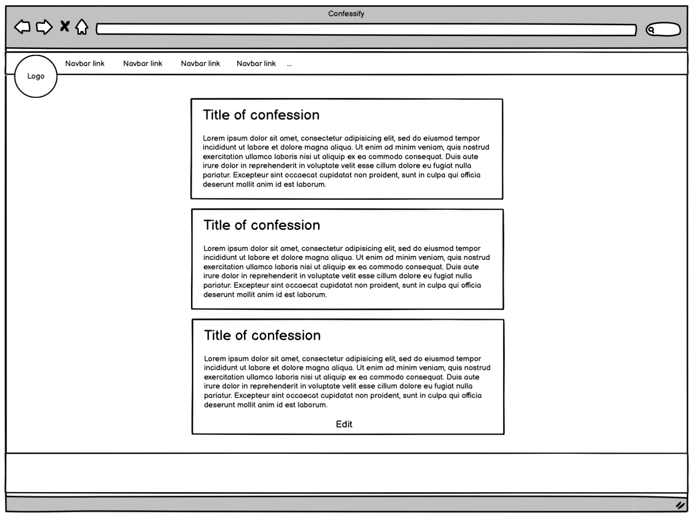

<h1 align="center">Confessify</h1>

A web application that connects people through the tradition of confession.

View live site [here](https://confessify.herokuapp.com/).

# UX

## User Story
- First Time Visistor
    - As a First Time Visitor, I want to be able to understand what can be done on this web app.
    - As a First Time Visitor, I want to be able to easily register so I can gain access to the app and it’s features.
- Frequent User
    - As a frequent user, I want to be able to login quickly and without hassle.
    - As a frequent user, I want to be able to create confessions and view other people’s confessions.
    - As a frequent user, I want to be able to edit and/or delete confessions when necessary.   

## Frontend Design
- Design Choices
    - The web app follows the principles of minimalist design. Each element of the app serves a purpose and serves the user in the most uncluttered way possible. This design choice aids the user by keeping features simple, obvious and effective. 

- Colour Scheme
    - The web app has a dark theme throughout, using only 2 colours to highlight and create retro imagery to the site.
        - #0dfafa (light blue)
        - #cd0635 (red)

- Typography
    - Throughout the app ‘Sora’ is used with a backup of ‘sans-serif’. Fonts were provided by Google fonts through a CDN. The main title image of the site was created using [fontmeme](https://fontmeme.com/handwriting-fonts/).

- Wireframes 
    ## Desktop
        - Home
    
        - Register
    
        - Input and Edit Form
    
        - Posts
    

    ## Mobile
    - Home 
   
    - Register 
   
    - Input and Edit Form 
   
    - Posts 
   
   
## Backend Design

- The web app's backend is made possible through PostgresSQL. The Database models/tables are shown below:
- The "id" column on each table auto generates and increments with each new record. All limitaions of the columns in terms of character length and acceptable inputs are enforced on each form of the site, ensuring all data input is valid. The data stored in each record is used to create sessions, providing defensive programming, only providing access to the logged in user, to edit or delete posts if they're the author of the selected post.
- The FK also has a cascading effect, meaning that if a certain user was to be deleted, so would all of the posts associated with that username.

# Features
- Interactive web app that is responsive on all devices.
- User authentication system (Login, Logout and Register)
- Content Feed
- Full CRUD functionality
- SQL Database

# Technologies Used
## Languages and Frameworks
 - HTML5
 - CSS3
 - Python
 - Flask
 - Postgresql and SQLAlchemy
 - Jinja Templating
 - Boostrap 5

 ## Other tools used:
1.	Google Fonts
    - Font: ‘Sora’
2.	Font Awesome
    - Icons were used on the navbar.
3.	Git
    - Git was utilised for version control through ‘commit’ and ‘push’ commands through the terminal.
4.	Github
    - Github was used to store code ‘pushed’ from Gitpod.
5.	Balsamiq
    - Balsamiq was used to outline both the desktop and phone wireframes.
6. Get CSS Scan
    - Used to source the foundational code that the main button is built on. Original code by Joe Bocock.

# Testing
- CSS passed W3C validation  

- Google Lighthouse showed favourable scores: 

- Python code is PEP8 compliant and free from error (checked at [pep8online](http://pep8online.com))

## Testing User Stories
- First Time Visistor
    - "As a First Time Visitor, I want to be able to understand what can be done on this web app."
        - Upon arrival to the site, the visitor is greeted with a hero image and a login screen. A first time visitor is prompted by a bright and colourful button that displays “Need to know more?”. The user is then taken to the register page, where they are first greeted by a brief and deliberately cryptic ‘about us’ message that follows on to the register page.
    - "As a First Time Visitor, I want to be able to easily register so I can gain access to the app and it’s features."
        - After registration, the navigation bar gives access to all the features of the site, including access to the confessions feed and confession form, where users are able to create a confession.

- Frequent User
    - "As a frequent user, I want to be able to login quickly and without hassle."
        -  There is a clear login screen on the landing page of the site that gives quick access to frequent users who know the web app and what they wish to accomplish with it.
    - "As a frequent user, I want to be able to create confessions and view other people’s confessions."
        - After logging in, the user is given access to both the confession form, to make confessions, and the posts feed, where other’s confessions can be viewed. 
    - "As a frequent user, I want to be able to edit and/or delete confessions when necessary."
        - Once on the confessions feed, full CRUD functionality is given if the logged in user is the author of the post. The edit page allows the user to update or delete their confessions.  

## Further Testing
The following browsers and devices were given a pass if all elements of the site perfromed and diplayed as inteended.
- Browsers
    - Chrome: Pass
    - Safari: Pass
    - Mozilla: Pass
    - Opera: Pass
- Devices
    - MacBook Air 13inch: Pass
    - iPhone 13 Pro: Pass
    - iPhone XS: Pass
    - iPhone 7 Plus: Pass
    - iPad Pro: Pass
    - OnePlus Nord: Pass
    - Huawei Mateview display: Pass
 - Real World Testing
     - Friends and family members were given access to the site to play with, and to see if they could 'break it'. The project also passsed this test. Feedback was positive, especially on the design of the site.

## Bug and Fixes
- Overhanging logo on mobile
    - There was an issue where the design choice to have the brand image overhanging the navbar, interfered with the visibility of the nav links when the nav toggler displayed on mobile devices. This was fixed by centering the navbar brand when on smaller devices and left aligning the nav links, to make them visible.
- Navbar brand image
    - There was another issue where the brand image would randomly not display on just the edit page. This was especially strange as it was extending from base.html and was displaying perfectly on all other pages. The issue seemed to be because the image was accidentally placed with src instead of url_for. Once the image was displaying with url_for it displayed as expected.
- Navbar Toggler
    - Upon deployment to Heroku, the navbar toggler that appears on smaller devices stopped working. Fix: The toggler needed an older boostrap cdn for the javascript to function as intended.

# Next Steps
- The next steps would be to add significant interactivity to the app, such as like buttons, reacting to confessions etc.
- A way of organising the confession feed is needed. This could be through newest to oldest, or most up-voted, for example.

# Deployment

## Deploying to Heroku
To deploy the site with Heroku:
1. In Gitpod, run the following command through the CLI: pip3 freeze --local > requirements.txt
2. Again, through the Gitpod CLI, run: echo web: python run.py > Procfile. If the Procfile has an empty new line below it, delete this.
3. Create/Login to Heroku account. Select "Create New App". Give the app a unique name and choose the region closest to you. Click "Create App".
4. From the dashboard, click on "Resources". From the "Add ons:" search bar, search for "heroku postgres" and select the "Hobby Dev" tier. 
5. Next, go to settings and "Reveal config vars". Fill out these key/value pairs, mirroring those of the github repo's enviroment variables. Database URL should already be populated with Heroku's postgres database. Fill out IP, PORT, SECRET_KEY and make sure on the deployed version, DEBUG is set to FALSE.
6. On the dashboard, select "Deploy" then select "GitHub". Search for the repository and select "Connect". Then "Enable automatic deploys" and the click "Deploy branch". When this is done, a message should say, "Your app was successfully deployed".
7. From the dashboard, click more and select "Run Console".
8. From Heroku's CLI, type in "python3", followed by "from confessify import db" then "db.create_all()" then exit the CLI with "exit()".
9. Click "Open App" to see the deployed web app!

## Forking the GitHub Repository
To create a copy of the project to experiment with changes in a safe way that will not affect the original site:
1.	Log into GitHub. Go to the GitHub Repository.
2.	Near the top of the Repository, click the “Fork” button in order to create a copy of the repository. 

## Making a Local Clone
1.	Log into GitHub go to the GitHub Repository.
2.	Click ‘Code’.
3.	To clone the repository using HTTPS, under "Clone with HTTPS", click the clipboard icon to copy the link. 
4.	Open Git Bash. 
5.	Change the current working directory to the location you want the cloned directory.
6.	Type ‘git clone’, add a space, then paste the URL that was copied earlier (step 3) and press enter. This should have created a clone.

For a detailed step-by-step guide with screenshots, click [here](https://docs.github.com/en/repositories/creating-and-managing-repositories/cloning-a-repository#cloning-a-repository-to-github-desktop).

# Credits
## Content
- All content written by Joshua Jones (Developer).
- All images created by Joshua jones (Developer), unless stated otherwise.
- The main button's original code  was by Joe Bocock, sourced from CSS Scan.
- The  example Code Institute Read Me file, on which this Read Me file is based on.
## Media
- All images and wireframes in this read me were created by the developer, Joshua Jones. 
## Acknowledgments
- My Mentor, Spencer Barriball, for his guidance and thoughtful feedback on the project.
- Tutor Support, for their invaluable support throughout the entire project.